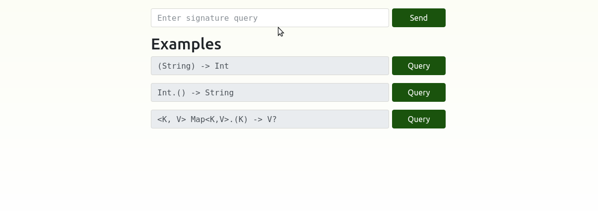
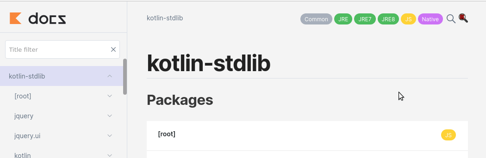

---


# Inkuire - query engine and dokka plugin generating database for executing semantic queries

---

The project is developed as the engineering thesis at AGH University of Technology in collaboration with VirtusLab - the 
creator of [dokka](https://github.com/Kotlin/dokka).

The goal of the project is to provide way of searching extensive functions and methods by given signature for JVM languages.
Currently supported langauge is Kotlin. Including Scala is taken into account.

---

Inkuire currently supports two different ways of serving. The first one is HTTP service.
Feel free to test tool locally or remotely at [inkuire.me](https://inkuire.herokuapp.com) which is hosted instance of engine fed with Kotlin Standard Library.



The latter is embeding inkuire directly into dokka output. You can also try it out using this [kotlin-stdlib](http://inkuire.s3.eu-central-1.amazonaws.com/master/stdlib/latest/kotlin-stdlib/kotlin-stdlib/index.html) instance



If you see any bugs, please inform us about it by creating issue in our repository [Github](https://github.com/VirtusLab/Inkuire)

---

### Basics

Inkuire consists of four modules:
1. Inkuire Dokka Plugin - This module is responsible for generating functions and types database from source code.
2. Inkuire HTTP Engine - This module is responsible for executing queries using REST API
3. Inkuire JS Engine - This module is responsible for embedding search engine in Dokka documentation.
4. Inkuire IntelliJ Plugin - This module allows you to run queries from IntelliJ.

---
### Input signatures

Currently tool accepts any correct Kotlin signature. Additionally, it supports `*` wildcard as a top-level star projection.

---

### Building Inkuire

Building Inkuire in order to run HTTP instance is quite straightforward:
1. Run command `sbt engineHttp/assembly` to produce fatJar of HTTP engine.
2. Run command `./gradlew dokka-common:db-generator:publishToMavenLocal` 
   to publish JAR with dokka extension for generating db files.

In order to build InkuireJS from source code:
1. Firstly, build InkuireJS by running command: `sbt engineJS/fastOptJS`. It needs to be done before other steps 
   because generated JS file will be copied to Dokka extension JAR.
2. Run command `./gradlew dokka-common:dokka-html-inkuire-extension:publishToMavenLocal`.

### Running Inkuire

#### Inkuire Dokka Plugin

In order to generate database, you need to configure Dokka in your project and apply our plugin. 
Running dokka task will generate .json files containing information further needed by engine.
Make sure you configure proper version of Dokka.

Currently Inkuire is compatible with dokka version 1.4.20

Depending on whether you want to run HTTP instance or embed search engine inside Dokka, you can use two different Dokka plugins.
In both cases you need to add to your `build.gradle` repository containing plugin JAR: it can be local Maven repository or Bintray.

```Kotlin
repositories {
    maven("https://dl.bintray.com/virtuslab/Inkuire")
}
```

EngineJS:
If you want to generate Dokka documentation with embedded Inkuire search engine, add this line to `build.gradle` dependencies block:
```Kotlin
dependencies {
    dokkaPlugin("org.virtuslab:inkuire-html-extension:0.1.1")
}
```

Engine HTTP:
If you want to generate only Inkuire db files, add this line to `build.gradle` dependencies block:
```Kotlin
dependencies {
    dokkaPlugin("org.virtuslab:inkuire-db-generator:0.1.1")
}
```


#### Inkuire HTTP Engine

Inkuire HTTP Engine provides HTTP service that allows you to run queries using its endpoints.

Inkuire Engine can be run by:
* Using sbt - `sbt engineHttp/run (Place for CLI args)`
* Using fatJar - `java -jar path_to_fatjar (Place for CLI args)`

#### Inkuire JS Engine

After generating Dokka documentation with embedded search engine, you need to create configuration:
1. Create configuration file by navigating to `<root>/scripts` and running command: `touch inkuire-config.json`.
2. Add mandatory options to your config. You can use this template:
```JSON
{
  "address": {"address": "0.0.0.0"},
  "port": { "port": 8080 },
  "dbPaths": [
    {"path" : "path to functions db files relative to <root>/scripts"}
  ],
  "ancestryGraphPaths": [
    {"path" : "path to ancestry graph db files relative to <root>/scripts"}
  ]
}
```
First two options are mandatory, but have no influence on engine runtime.
Last two options are the most important. There's limitation coming from implementation that db files need to be in scope of `scripts` folder.
In default, they are generated in `scripts/inkuiredb/...` path which is correct.
The database files cannot be autoconfigured yet, because of Inkuire supports only single platform at the moment, so it's up to user to define config.
We hope that in future release Inkuire will support multiplatform and autoconfiguration as well.

##### CLI Arguments

* Address - `--address` - Mandatory argument that defines address to which app should bind
* Port - `--port | -p` - Mandatory argument that defines port to which app should bind
* Ancestry graph paths - `{ --ancestry | -a }` - Arguments that define URLs to ancestry graph JSONs
* Function database paths - `{ --database | -d }` - Arguments that define URLs to function database JSONs

Don't forget that URLs need to have protocol prefix, so if you want to provide path to a local file, it needs to be in `file://(path)` format.
Also if the paths point to directories, all files with extensions `.adb.inkuire` and `.fdb.inkuire` respectively for ancestry graph and database will be loaded.

##### API Endpoints

* `/` - It redirects you to "/query"

* `/query` - Static html page that allows you to run query by filling in form. It also contains some examples.

* `/forSignature` - This endpoint takes signature as param and returns JSON with results. It can be used by external tools to get query results.

##### `/forSignature` usage

Endpoint handles GET requests in format `/forSignature?signature=SIGNATURE` where SIGNATURE is query signature.

Output format is JSON with fields:
* `query` - Contains executed query
* `matches` - Contains array of objects with fields: 
    * `prettifiedSignature` - Matched signature
    * `functionName` - Name of matched function
    * `packageLocation` - Location of matched function (package wise)
    * `pageLocation`- Location of matched function (dokka wise)
    
#### Inkuire IntelliJ Plugin

IntelliJ plugin is in early developement, but if you want to try it, you need to run Inkuire Engine locally, and then run `./gradlew runIde`. It will run IntelliJ instance with our plugin enabled. You can open plugin by pressing: `Tools->Inkuire` 

---

#### Importing project in IntelliJ IDEA

There are two build tools included in building project. To obtain best experinece of developing the code while having
code completion and type inference one should import project to IDEA following these steps:

1. Import the project from build.sbt and wait for IntelliJ to index all the files. You should be able to see sbt ont the right panel as well as the submodules it is governing.
2. Go to File -> Project Structure -> Modules and select Add -> Import module
3. Import project from build.gradle.kts and wait for IntelliJ to index all files.
4. You should be able to see both sbt and gradle widgets on right bar.
5. When developing sbt sources or gradle sources make sure to have project reloaded for your build tool project schema. Just open sbt/gradle sidemenu and click `Reload all [sbt/Gradle] projects`

