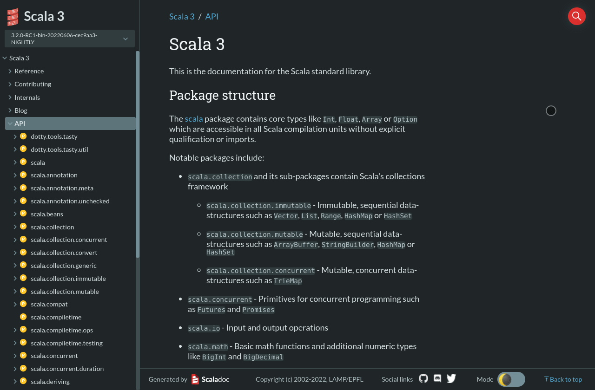

---
</img>

# Inkuire - Hoogle-like searches for Scala 3 and Kotlin

---

The project was created as the engineering thesis at AGH University of Technology in collaboration with VirtusLab - the 
creators of [dokka](https://github.com/Kotlin/dokka) and [scaladoc](https://github.com/lampepfl/dotty/tree/master/scaladoc).

The goal of the project is to provide way of searching extensive functions and methods by given signature for JVM languages.
Currently supported langauges are Kotlin and Scala 3.

---

## Live Demo

Feel free to test Inkuire locally or remotely at:
- Scaladoc for stdlib with Inkuire support -> [here](https://dotty.epfl.ch/api/index.html)

---

## Scala 3 Video Demo:

Scaladoc:

---

If you see any bugs, please create an issue on [Github](https://github.com/VirtusLab/Inkuire)

For Kotlin support see [kotlin](https://github.com/VirtusLab/Inkuire/tree/kotlin) branch.
